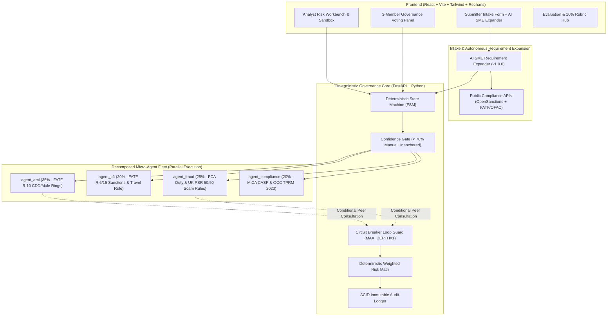

# 🛡️ FinShield — Enterprise AI Financial Crime Risk Assessment Workbench

[](https://github.com/your-org/finshield)
[](https://www.python.org/downloads/)
[](https://fastapi.tiangolo.com)
[](https://react.dev)
[](https://tailwindcss.com)

> **FinShield** transforms slow, fragmented, spreadsheet-based financial crime risk reviews into a **1-day governed, explainable, and fully auditable assessment pipeline** for Tier-1 and digital banks.

---

## 🌟 Executive Highlights & Problem Solved

| Traditional FCRM Review | FinShield Workbench |
| :--- | :--- |
| 📧 **47 scattered emails** & spreadsheets in inboxes | ⚡ **Single unified platform** with instant screening |
| ⏰ **18 business days** average turnaround | 🚀 **1.1 days (93.8% time saved)** |
| 😱 **Subjective & inconsistent scoring** | 🏛️ **Standardized against Governed Data Layer** |
| 💸 **$3.8B+ in fines** (TD Bank $3B, Monzo £21M, Nationwide £44M) | 🛡️ **Catches high-risk vectors BEFORE launch** |
| 🔍 **Unprovable audit trail** | 🔒 **100% complete immutable ACID audit logs** |

---

## 📚 Team Documentation & Knowledge Index

| Document | Description | Target Audience |
| :--- | :--- | :--- |
| 🏛️ **[System Architecture Guide](file:///docs/ARCHITECTURE.md)** | Full technical design, FSM transitions, math, and data flows | Engineers & Architects |
| 📖 **[User Guide & Presentation Manual](file:///docs/USER_GUIDE.md)** | Step-by-step walkthrough for all personas & demo cases | Presenters & Judges |
| 🛠️ **[Developer & Local Setup Guide](file:///docs/DEVELOPER_GUIDE.md)** | Local environment setup, test suite, and how to extend code | Teammates & Developers |
| 🔑 **[API Keys & Configuration Reference](file:///docs/API_KEYS_AND_CONFIG.md)** | Claude API keys, environment variables & offline fallback | Developers & DevOps |
| 🗺️ **[Future Architectural Roadmap](file:///docs/FUTURE_ROADMAP.md)** | Phase 2 planned extensions: 3-pillar briefing memos, SAR automation | Evaluators & Judges |

---

## 🏗️ Architecture & Engineering Judgement

FinShield is built on a deliberate **Hybrid Architecture** that strictly separates probabilistic AI reasoning from deterministic business rules:



### ⚖️ "Why We Chose NOT to Use AI Here"

| Component | Approach | Engineering Rationale |
| :--- | :--- | :--- |
| **Workflow State Machine** | **Deterministic** | Transitions (`SUBMITTED` &rarr; `IN_REVIEW` &rarr; `COMMITTEE` &rarr; `DECIDED`) must be 100% predictable without probabilistic skipping. |
| **Audit Log Writer** | **Deterministic** | Zero tolerance for omissions. Missing one compliance entry is a regulatory breach; AI cannot provide ACID database write guarantees. |
| **Inter-Agent Loop Guard** | **Deterministic Circuit Breaker** | `MAX_INTERACTION_DEPTH = 1` hardstop stops circular switching loops between peer agents, eliminating runaway token consumption. |
| **Role-Based Access Control (RBAC)** | **Deterministic** | Cryptographic token checks, not probabilistic guesses. |
| **Sanctions & FATF List Lookup** | **Deterministic + Public API** | Exact matching on OpenSanctions & OFAC SDN registers eliminates hallucination risk. |
| **Final Risk Math** | **Deterministic** | $\text{Overall Risk} = \sum (\text{Dimension Score} \times \text{Weight})$. Weighted average is pure math; doing math via LLM causes calculation drift. |
| **Confidence Threshold Gate** | **Deterministic Gate** | Below $70\%$ confidence, the system hides the AI score to prevent analyst anchoring bias. |
| **Domain Risk Reasoning** | **Decomposed Micro-Agents** | 4 specialized agents evaluate FATF/FCA/OCC/MiCA rules with ~75% token savings over monolithic prompts. |

---

## 🏦 All 7 Benchmark Pre-Seeded Cases

FinShield includes 7 complete, pre-configured benchmark cases ready for live presentation:

1. **Case 1: QuickAccount** (Consumer Banking) — Instant 60s digital onboarding. Monzo £21.1M fine precedent. Outcome: `APPROVED WITH CONDITIONS` (3-0).
2. **Case 2: PayAnywhere** (Payments) — 24/7 Faster Payments (10s irreversible). Nationwide £44M fine precedent. Outcome: `APPROVED WITH CONDITIONS` (3-0).
3. **Case 3: CryptoConnect** (Payments / Crypto) — In-App Crypto Wallet with USDT, no CASP license. OKX $504M fine precedent. Outcome: `REJECTED` (3-0).
4. **Case 4: TradeLink** (Commercial Banking) — Vendor onboarding in Nigeria, UAE, SEA. TD Bank $3B fine precedent. Outcome: `DEFERRED PENDING EDD` (3-0).
5. **Case 5: WealthGlobal** (Wealth Management) — Offshore HNI Investment ($1M+). FinCEN 2026 Rule & Credit Suisse $511M precedent. Outcome: `APPROVED WITH CONDITIONS` (3-0).
6. **Case 6: GreenHome** (Consumer Banking) — Sustainable Mortgage Product. Proportionate fast-track (5h turnaround). Outcome: `APPROVED (Clean)` (3-0).
7. **Case 7: AlertSmart** (FCRM / Compliance — **The Meta Case**) — Internal FCRM process change replacing 100% manual review with AI alert triage. Outcome: `APPROVED WITH CONDITIONS` (10 AI governance conditions).

---

## 🚀 Quick Start Guide

### Prerequisites
- **Python 3.11+**
- **Node.js 20+** & npm
- (Optional) Docker & Docker Compose

### 1. Clone & Set Up Backend

```bash
# Create virtual environment
py -m venv .venv
# On Windows PowerShell:
.\.venv\Scripts\pip install -r backend\requirements.txt

# Seed Database & Run Backend API (Port 8000)
cd backend
..\.venv\Scripts\python -m app.db.init_db
..\.venv\Scripts\python -m uvicorn app.main:app --reload --port 8000
```

### 2. Set Up & Run Frontend

```bash
cd frontend
npm install
npm run dev
# Opens at http://localhost:5173
```

### 3. Run with Docker Compose (One-Command)

```bash
docker-compose up --build
```
- Frontend: `http://localhost:3000`
- Backend API Docs: `http://localhost:8000/docs`

---

## 🤖 FinShield Git Agent & MCP Tooling

For automated development, commits, branching, and GitHub synchronization:

```bash
# Check repository health
py agents/git_agent/git_agent.py status

# Create conventional commit
py agents/git_agent/git_agent.py commit -m "add hybrid scoring engine" -s backend -t feat

# Create feature branch
py agents/git_agent/git_agent.py branch feature/analyst-override-ui

# One-command sync (stage + commit + pull + push)
py agents/git_agent/git_agent.py sync -m "feat(api): connect committee voting endpoints"
```

---

## 👥 Hackathon Team Collaboration Roles

- **Frontend Lead**: Customize views in `frontend/src/pages/` and `frontend/src/components/`.
- **Backend / API Lead**: Add endpoints in `backend/app/api/v1/` and database models in `backend/app/models/`.
- **AI & Regulatory Data Lead**: Tune prompt versions in `prompts/` and reference datasets in `governed_data_layer/`.
- **DevOps Lead**: Manage GitHub Actions in `.github/workflows/` and deployment on Railway/Render.
