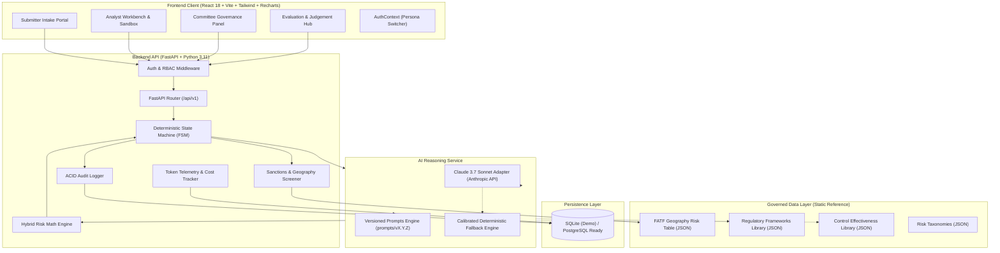
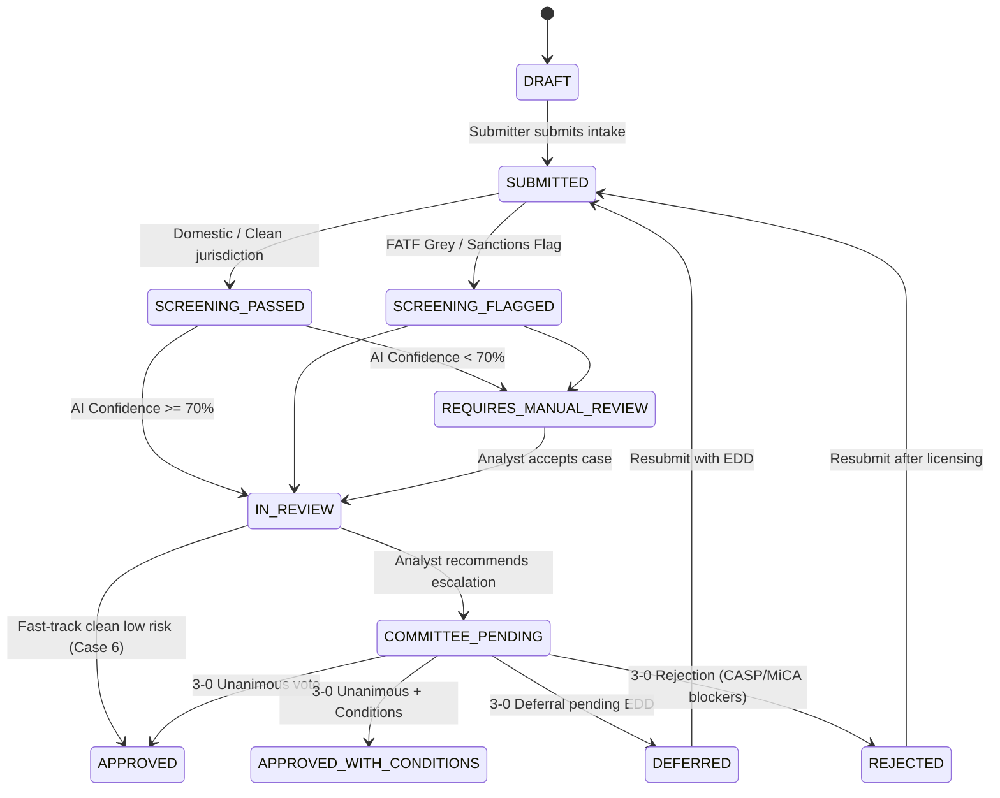

# 🏛️ FinShield — System Architecture Guide

> **Target Audience**: Hackathon Teammates, Technical Evaluators, Platform Engineers  
> **Repository**: `Finshield`  
> **Version**: 2.6.0  

---

## 1. High-Level Architectural Vision

FinShield is an enterprise-grade AI-powered **Financial Crime Risk Assessment Workbench**. It automates the intake, screening, scoring, analyst calibration, and committee governance for financial products, payment features, third-party vendor onboarding, and internal compliance operational changes.

### Core Architectural Principles
1. **Separation of Reasoning & Calculation (Hybrid Scoring)**:
   - **Probabilistic AI (Claude 3.7 Sonnet)**: Analyzes unstructured specifications and synthesizes regulatory frameworks (FATF, FCA, NACHA, MiCA, FinCEN, OCC).
   - **Deterministic Code**: Weighted risk mathematical averages, diminishing returns control calculations, finite state machine transitions, and ACID audit logging.
2. **Confidence Threshold Gating**:
   - Scores with $<70\%$ AI confidence are suppressed from the analyst UI to prevent human anchoring bias.
3. **Immutable Audit Proofing**:
   - Every status transition, override reason, and committee vote is stored in an immutable, append-only event log.
4. **Governed Reference Data**:
   - AI reasons strictly over verified taxonomies, high-risk geography tables, and approved control libraries to eliminate regulatory hallucinations.

---

## 2. End-to-End System Diagram



---

## 3. Directory Layout & Module Ownership

```
Finshield/
├── backend/                       # Python FastAPI Backend
│   ├── app/
│   │   ├── api/v1/                # REST API Endpoints
│   │   │   ├── auth.py            # User authentication & Persona switcher
│   │   │   ├── cases.py           # Case portfolio & intake creation pipeline
│   │   │   ├── ai_assessment.py   # Overrides, What-If sandbox, AI Copilot chat
│   │   │   ├── committee.py       # 3-member committee votes & decision lock
│   │   │   ├── audit.py           # Immutable audit log queries
│   │   │   ├── evaluation.py      # Telemetry, "Why Not AI" matrix, benchmarks
│   │   │   └── data_layer.py      # Governed reference data endpoints
│   │   ├── core/                  # Core architectural building blocks
│   │   │   ├── config.py          # Settings, env vars, CORS
│   │   │   ├── security.py        # Salted password hashing, JWT tokens
│   │   │   └── fsm.py             # Deterministic Finite State Machine
│   │   ├── db/                    # Database configuration & seeding
│   │   │   ├── session.py         # SQLAlchemy engine & session factory
│   │   │   └── init_db.py         # Database seeder (Seeds 13 users & 7 cases)
│   │   ├── models/                # SQLAlchemy ORM Models
│   │   │   ├── user.py            # User & Role models
│   │   │   └── case.py            # RiskCase, Dimensions, Controls, Votes, Audit
│   │   ├── services/              # Business Logic & AI
│   │   │   ├── scoring_engine.py  # Weighted math, residual formula, confidence gate
│   │   │   ├── screening_service.py # Deterministic geography & sanctions lookup
│   │   │   ├── ai_service.py      # Claude API caller + offline fallback engine
│   │   │   └── token_tracker.py   # Live token cost & savings calculator
│   │   └── main.py                # FastAPI app entry point & lifespan handler
│   ├── tests/                     # Pytest suite (FSM, Math, Screening)
│   └── requirements.txt           # Python dependencies
│
├── frontend/                      # React 18 + Vite + TailwindCSS Frontend
│   ├── src/
│   │   ├── components/
│   │   │   ├── common/            # Navbar, RiskBadge, OutcomeBadge, TokenCostModal
│   │   │   ├── submitter/         # IntakeForm with real-time screening preview
│   │   │   ├── analyst/           # RiskDimensionCard, OverrideModal, WhatIfSandbox, TraceabilityChain
│   │   │   ├── committee/         # VotingPanel, ConditionsManager, DecisionLockModal
│   │   │   └── evaluation/        # JudgementMatrixTable, TokenEfficiencyPanel, BenchmarkComparison, BeforeAfterHero
│   │   ├── contexts/              # AuthContext (Role & Persona state)
│   │   ├── services/              # Axios API client (api.js)
│   │   ├── pages/                 # DashboardPage, CaseDetailPage, NewCasePage, EvaluationHubPage
│   │   ├── App.jsx                # Root view router
│   │   ├── index.css              # Glassmorphism utilities & fintech design tokens
│   │   └── main.jsx               # React DOM entry
│   ├── package.json
│   ├── vite.config.js
│   └── tailwind.config.js
│
├── governed_data_layer/           # Reference Knowledge Base
│   ├── geography_risk_table.json  # FATF high-risk corridors & multipliers
│   ├── regulatory_frameworks.json # FATF, FCA, NACHA, MiCA, FinCEN, OCC
│   ├── control_library.json       # Control catalog & effectiveness percentages
│   └── risk_taxonomies.json       # ML, TF, Fraud, Compliance typology definitions
│
├── prompts/                       # Semantic Version Controlled Prompts
│   ├── risk_scoring/              # Multi-dimension risk reasoner prompts
│   ├── doc_parser/                # Intake extractor prompts
│   └── draft_generator/           # Committee memo generation prompts
│
├── agents/                        # Automation & MCP Agents
│   └── git_agent/                 # Git Agent CLI & MCP server
│       ├── git_agent.py
│       ├── mcp_git_server.json
│       └── README.md
│
├── docs/                          # Comprehensive Team Documentation
│   ├── ARCHITECTURE.md            # This document
│   ├── USER_GUIDE.md              # User & demo manual
│   ├── DEVELOPER_GUIDE.md         # Local contribution & extension guide
│   └── API_KEYS_AND_CONFIG.md     # Environment variables & API credentials
│
├── .github/workflows/ci.yml       # GitHub Actions CI pipeline
├── docker-compose.yml             # Container orchestration
├── Dockerfile.backend             # Backend image definition
├── Dockerfile.frontend            # Frontend image definition
├── nginx.conf                     # Reverse proxy configuration
└── README.md                      # Primary project readme
```

---

## 4. Deterministic Finite State Machine (FSM)

The workflow transitions are strictly governed by `backend/app/core/fsm.py`:



---

## 5. Mathematical Scoring & Diminishing Returns

### Inherent Risk Math
The inherent risk score is calculated deterministically as the weighted sum of the 4 dimension scores:
$$\text{Inherent Score} = (S_{\text{ML}} \times 0.35) + (S_{\text{TF}} \times 0.20) + (S_{\text{Fraud}} \times 0.25) + (S_{\text{Compliance}} \times 0.20)$$

### Controls Reduction Math (Diminishing Returns)
When multiple controls $\{c_1, c_2, \dots, c_n\}$ with effectiveness $e_i \in [0, 1]$ are applied:
$$\text{Cumulative Multiplier} = \prod_{i=1}^n (1 - \min(e_i, 0.90))$$
$$\text{Overall Reduction} = 1 - \text{Cumulative Multiplier}$$
$$\text{Residual Score} = \max(\text{Inherent Score} \times (1 - (\text{Overall Reduction} \times 0.75)), 1.0)$$

> **Rule**: Controls mitigate risk but can **never** eliminate it completely (floor $= 1.0$).

---

## 6. Security & RBAC Design

- **Authentication**: Salted SHA-256 password hashing with unique salt per user + JWT bearer tokens signed with `HS256`.
- **Role-Based Access Control (RBAC)**:
  - `SUBMITTER`: Can create proposals and view own outcome notifications.
  - `ANALYST`: Can view all cases, apply overrides with mandatory reasons, run What-If simulations, and escalate to committee.
  - `COMMITTEE_MEMBER`: Can record independent votes and rationales (CRO, CCO, Legal Counsel), modify conditions, and seal decisions.
  - `ADMIN`: Full platform configuration and audit logs access.
