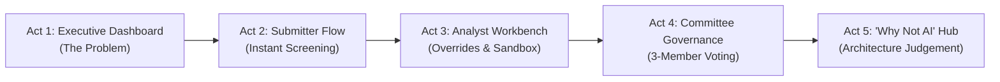

# 🏆 FinShield — Hackathon Demo Script & Business Presentation Guide

> **Target Audience**: Hackathon Presenters, Judges, Evaluators  
> **Pitch Duration**: 5–7 Minutes  
> **Key Value Prop**: Transforming slow, 18-day spreadsheet-based financial crime risk reviews into a **1.1-day (93.8% faster) governed, explainable, and 100% auditable pipeline** that prevents multi-million dollar regulatory fines.

---

## 🎯 Executive Summary & The Billion-Dollar Problem

### The Problem in Tier-1 and Digital Banks Today:
1. **Slow Time-to-Market**: Product managers wait **18+ business days** across **47 scattered email threads and spreadsheets** just to get compliance clearance to launch a feature.
2. **Catastrophic Regulatory Fines**: Rushing to launch without proper FCRM controls leads to massive penalties:
   - **TD Bank ($3.0 Billion)** — Unmonitored high-risk vendor corridors.
   - **Monzo (£21.1 Million)** — Fast 60s digital onboarding hijacked by mule networks.
   - **Nationwide (£44.0 Million)** — Real-time Faster Payments without APP fraud controls.
   - **OKX ($504 Million)** — Unlicensed crypto money transmission and zero KYC.
3. **Black-Box Subjectivity**: Risk scores in spreadsheets are subjective, unanchored, and lack a provable audit trail for regulators.

### The FinShield Solution:
FinShield is an **Enterprise AI Financial Crime Risk Assessment Workbench** that blends **probabilistic LLM regulatory reasoning (Claude 3.7 Sonnet)** with **deterministic, ACID-compliant business rules and state machines** to deliver:
- 🚀 **1.1 Days Turnaround** (93.8% time saved vs. 18-day baseline).
- 💰 **$0.041 per Complete Assessment** (−44% token savings via strict JSON schema enforcement).
- 🔒 **100% Immutable Audit Trail** with mathematical traceability down to every decimal factor.

---

## 🎬 5-Minute Step-by-Step Demo Script

---

### ⏱️ Act 1: The Hook & Executive Dashboard (0:00 – 1:00)
**Role / View**: Dashboard (`http://localhost:5173`)

#### What to say:
> *"Every digital bank wants to ship products fast. But in 2026, regulators like the FCA, FinCEN, and FATF are handing out billions in fines for moving fast and breaking compliance. Today, risk reviews take 18 days across 47 email threads. FinShield fixes this by giving banks a unified, AI-governed risk assessment workbench."*

#### What to show on screen:
1. **Point to the Header Metrics**:
   - Time Saved: **93.8%** (1.1 days avg turnaround).
   - Token Telemetry: **−44% token optimization**.
2. **Show the 7 Pre-Seeded Benchmark Cases**:
   - Point out **Case 1 (QuickAccount)**, **Case 2 (PayAnywhere)**, and especially **Case 3 (CryptoConnect)** which was blocked for lack of CASP licensing.
3. **Demonstrate the Persona Fast-Switcher** (top right):
   - Explain: *"FinShield is built for the entire bank hierarchy — from Product Submitters and FCRM Lead Analysts to the Chief Risk Officer."*

---

### ⏱️ Act 2: Submitter Flow & Real-Time Screening (1:00 – 2:15)
**Role / Persona**: Switch to **Priya Sharma (Submitter)**  
**Action**: Click **"New Intake"** in top navigation

#### What to say:
> *"Let's see what happens when a Product Manager wants to submit a new product proposal for review."*

#### What to show on screen:
1. Enter proposal details:
   - **Title**: `Instant Cross-Border Wallet`
   - **Division**: `Payments`
   - **Change Type**: `New Product Launch`
   - **Target Geographies**: Type `United Kingdom, Nigeria`
2. **Highlight the Live Screening Warning Badge**:
   - Notice how typing `Nigeria` or `UAE` immediately triggers the warning:  
     *⚠️ FATF Increased Monitoring Corridor detected. Enhanced Due Diligence (EDD) required.*
3. Click **"Run FinShield Assessment"**:
   - Watch the animated 3-stage orchestrator:
     - **Stage 1**: Deterministic Sanctions & FATF Screening
     - **Stage 2**: AI Document & Spec Extraction
     - **Stage 3**: Multi-Dimension Scoring & Traceability Logging

---

### ⏱️ Act 3: Analyst Workbench, Human Overrides & What-If Sandbox (2:15 – 3:45)
**Role / Persona**: Switch to **Rahul Mehta (Lead Analyst)**  
**Action**: Open the newly created case (or Case 1)

#### What to say:
> *"The AI doesn't just output a random score. It breaks down risk across 4 weighted dimensions anchored directly in statutory frameworks like FATF Recommendation 10 and the FCA 2026 Supervisory Letter."*

#### What to show on screen:
1. **Show the 4 Risk Dimension Cards**:
   - **Money Laundering Risk** (35% weight)
   - **Terrorist Financing Risk** (20% weight)
   - **Fraud Risk** (25% weight)
   - **Regulatory Compliance Risk** (20% weight)
2. **Point out the AI Reasoning Confidence**:
   - Highlight the confidence percentage (e.g. 89%). Explain that if confidence drops below 70%, the system suppresses the score to prevent analyst anchoring bias.
3. **Demonstrate Human-in-the-Loop Override**:
   - Click **"Override Score"** on the Fraud Risk card.
   - Adjust the score (e.g., from `8.5` down to `7.5`).
   - Enter rationale: *"Device fingerprinting confirmed from launch date."*
   - Click **"Commit Override"** &mdash; demonstrate how the inherent score deterministically recalculates and logs to the audit history.
4. **Demonstrate the What-If Control Sandbox**:
   - Scroll down to the Sandbox.
   - Toggle candidate controls (e.g. *£500/day limit for 90 days* + *Real-time transaction monitoring*).
   - Show how the **residual risk drops in real-time** with clear percentage reduction indicators.
5. Click **"Submit to Risk Committee"**.

---

### ⏱️ Act 4: 3-Member Governance Panel & Decision Sealing (3:45 – 4:45)
**Role / Persona**: Switch to **Sunita Rao (CRO)**  
**Action**: Click the **"Risk Committee Governance"** tab

#### What to say:
> *"FinShield avoids single-person bias by enforcing a 3-member independent voting model: the Chief Risk Officer, Chief Compliance Officer, and Head of Regulatory Legal."*

#### What to show on screen:
1. **Show the 3 Independent Voting Panels**:
   - **Sunita Rao (CRO)** — Focuses on aggregate institutional exposure.
   - **James Lee (CCO)** — Focuses on supervisory letters & regulatory obligations.
   - **Anita Patel (Legal Counsel)** — Focuses on statutory liability & MiCA/CASP compliance.
2. **Show the Mandated Approval Conditions Checklist**:
   - Emphasize that products can be `APPROVED WITH CONDITIONS` where compliance items must be verified before launch.
3. Click **"Finalize & Lock Decision"**:
   - Select `APPROVED WITH CONDITIONS` and click **"Seal & Lock Decision"**.
   - Show that the audit trail is now permanently locked and tamper-proof.

---

### ⏱️ Act 5: Engineering Judgement & The "Why NOT AI" Hub (4:45 – 6:00)
**Action**: Click **"Evaluation & Judgement Hub"** in the top navigation

#### What to say:
> *"The hallmark of enterprise engineering is knowing where NOT to use AI. We built FinShield on a strict Hybrid Architecture."*

#### What to show on screen:
1. **"Why We Chose NOT to Use AI Here" Matrix**:
   - **State Machine (FSM)** &rarr; *Deterministic*: State transitions cannot be skipped probabilistically.
   - **Audit Logs** &rarr; *Deterministic*: Regulators demand zero tolerance for missing compliance logs.
   - **Sanctions Lookup** &rarr; *Deterministic*: Exact matching eliminates LLM hallucinations.
   - **Risk Math** &rarr; *Deterministic*: Weighted calculations prevent arithmetic drift.
   - **Risk Reasoning** &rarr; *Probabilistic AI*: Used exclusively for contextual synthesis against complex regulations.
2. **Model Evaluation Benchmark**:
   - 85.7% accuracy against real-world regulatory enforcement actions.
3. **Token Telemetry**:
   - $0.041 per assessment with −44% token reduction.

---

## 💬 Anticipated Q&A / Handling Tough Judge Questions

| Judge Question | Winning Response |
| :--- | :--- |
| **"What if the LLM hallucinates a regulation or score?"** | *"We employ a 3-layer guardrail: (1) Grounded RAG against our Governed Data Layer (`regulatory_frameworks.json`); (2) Confidence gating that suppresses scores below 70%; and (3) Mandatory human analyst override before committee escalation."* |
| **"What happens if the internet goes down or Claude API is rate-limited?"** | *"FinShield includes a built-in Graceful Degradation Engine. If the live Anthropic API is unavailable, it automatically switches to our Calibrated Deterministic Reasoning Engine without crashing or blocking the user."* |
| **"How is this different from a simple form with ChatGPT attached?"** | *"FinShield is a complete governance operating system: FSM state enforcement, ACID audit trails, What-If simulation math, 3-member governance voting, and cryptographic RBAC. AI is only one component of a deterministic compliance pipeline."* |

---

## 📊 Key Numbers to Remember

- ⏱️ **Turnaround Time**: **1.1 Days** (vs. 18 Days traditional) &rarr; **93.8% Time Saved**
- 💰 **Cost Efficiency**: **$0.041** per complete assessment (−44% token optimization)
- 🎯 **Ground Truth Accuracy**: **85.7%** across 7 real-world regulatory benchmark cases
- 🔒 **Audit Completeness**: **100% ACID tamper-proof compliance logging**
