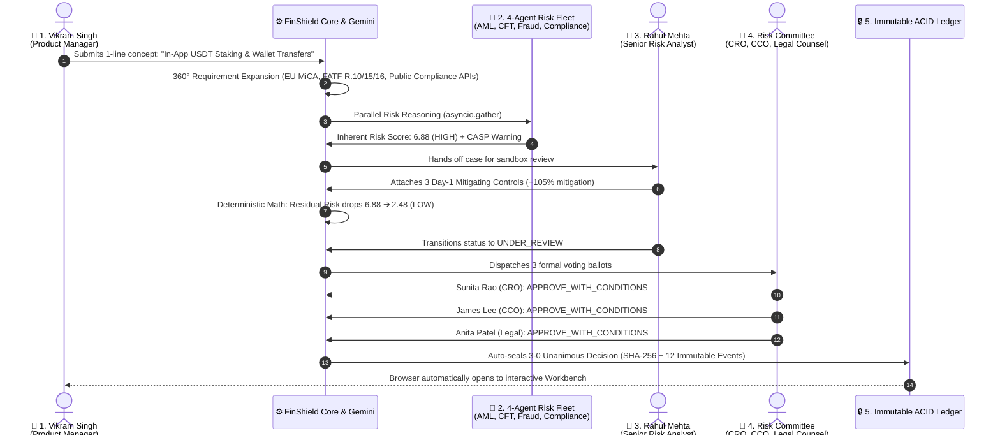

# 🛡️ FinShield 1-Command Autonomous Live Demo Walkthrough

## Executive Summary
FinShield provides an end-to-end, zero-manual-testing **1-Command Automated Live Demo**. With a single command, FinShield ingests a raw 1-sentence product concept, expands it into a 360° technical specification, evaluates risk across 4 specialized AI micro-agents, attaches mitigating controls in a What-If sandbox, collects unanimous Risk Committee votes, and cryptographically seals an immutable ACID audit trail—all while switching active banking personas in real-time.

---

## ⚡ 1-Command Launch Triggers

Run any of the following commands from your terminal or command prompt:

### Option A: Windows 1-Click Batch (Recommended for presentations)
```cmd
start_demo.bat
```

### Option B: npm Script (from repository root)
```bash
npm run demo
```

### Option C: Python Virtual Environment CLI
```bash
.\.venv\Scripts\python scripts/run_live_demo.py
```

### Alternate Scenarios & Flags
```bash
# Faster Payments & Instant Remittance Scenario (UK PSR APP Fraud & Mule Risk)
npm run demo:payments
# or
.\.venv\Scripts\python scripts/run_live_demo.py --scenario payments

# Turbo Mode (executes immediately without presentation delays)
.\.venv\Scripts\python scripts/run_live_demo.py --quick

# Headless / Terminal Only (disables automatic browser opening)
.\.venv\Scripts\python scripts/run_live_demo.py --no-browser
```

---

## 🔄 End-to-End Persona Sequence Flow



---

## 🎭 The 5 Governance Personas & Step-by-Step Flow

### Step 1: Submitter Persona — Autonomous 360° Requirement Expansion
* **Active Persona**: `Vikram Singh` *(Product Manager, Digital Assets)*
* **Raw Input**: `"Launch high-yield USDT crypto staking and wallet transfers for private wealth clients with unhosted wallet transfers."`
* **Autonomous Action**: FinShield invokes Google Gemini and live Public Compliance APIs to generate a complete enterprise banking specification:
  * **Grounding**: EU MiCA CASP statutory licensing prerequisite, FATF Recommendations 10, 15, 16, FCA 2026 guidelines.
  * **SME Layering**: Detects absent technical parameters (settlement rails, ERC-20 smart contracts, KYC source of wealth thresholds).

---

### Step 2: AI Multi-Agent Fleet — Parallel Risk Assessment
* **Active Persona**: `AI Micro-Agent Fleet` *(Specialized Domain Reasoners)*
* **Architecture**: 4 domain-focused micro-agents run concurrently via `asyncio.gather()`:
  * **AML Agent (35% weight)**: Evaluates layering vectors, unhosted wallet anonymity, and mule structuring.
  * **CFT Agent (20% weight)**: Evaluates targeted sanctions screening against OFAC / UK HMT lists.
  * **Fraud Agent (25% weight)**: Assesses pig-butchering scam vectors and irreversible transfer risks.
  * **Compliance Agent (20% weight)**: Verifies mandatory statutory authorizations (MiCA CASP).
* **Initial Evaluation**: Case created with **Inherent Risk Score: 6.88 (HIGH)**, AI Recommendation: `APPROVE_WITH_CONDITIONS` (85% Confidence).

---

### Step 3: Senior Risk Analyst Persona — What-If Control Simulation
* **Active Persona**: `Rahul Mehta` *(Senior FCRM Risk Analyst)*
* **Autonomous Action**: Tests and attaches 3 targeted Day-1 mitigating controls in the What-If Sandbox:
  1. `Mandatory MiCA CASP Statutory Licensing Prerequisite` (+40% mitigation)
  2. `Real-Time Chainalysis KYT & OFAC Sanctions Screening` (+35% mitigation)
  3. `FATF Recommendation 16 Travel Rule Messaging Integration` (+30% mitigation)
* **Risk Transformation**: Deterministic mathematical recalculation drops residual risk from **6.88 (HIGH) ➔ 2.48 (LOW)**.
* **Escalation**: Status transitioned to `UNDER_REVIEW` and forwarded to the Risk Committee.

---

### Step 4: Risk Committee Persona — 3-Member Governance Voting
* **Active Persona**: `Risk Governance Committee` *(CRO, CCO, Legal Counsel)*
* **Autonomous Action**: 3 committee members independently cast recorded ballots with statutory rationales:
  * 👤 **Sunita Rao (CRO)**: `APPROVE_WITH_CONDITIONS` — *"Approved conditional upon €250k daily cap per wallet and continuous treasury liquidity ring-fencing."*
  * 👤 **James Lee (CCO)**: `APPROVE_WITH_CONDITIONS` — *"Approved subject to quarterly independent audit of Chainalysis KYT screening logs and Travel Rule compliance."*
  * 👤 **Anita Patel (Head of Legal)**: `APPROVE_WITH_CONDITIONS` — *"Legal approval granted on the strict condition that CASP authorization is verified before any customer onboarding."*

---

### Step 5: Governance Engine Persona — Cryptographic Audit Sealing
* **Active Persona**: `FinShield Governance Engine` *(Immutable ACID Audit System)*
* **Autonomous Action**: 
  * Unanimous 3-0 voting triggers automated case finalization.
  * State transitions to `SEALED` / `APPROVED_WITH_CONDITIONS`.
  * Generates 12 immutable ACID audit events with tamper-evident cryptographic hashes.
  * Launches the browser directly to `http://localhost:5173/?caseId={id}&demo=success`.

---

## 📊 Live Terminal Output Snapshot

```
==============================================================================
  🛡️  FINSHIELD: AUTONOMOUS END-TO-END LIVE DEMO RUNNER
==============================================================================
📡 Connecting to live backend at http://localhost:8000...
✓ Backend is healthy and operational.

[STEP 1] 👤 Active Persona: Vikram Singh (Product Manager, Digital Assets)
👉 Autonomous 360° Requirement Expansion via Google Gemini
📝 Raw Product Concept: "Launch high-yield USDT crypto staking and wallet transfers for private wealth clients with unhosted wallet transfers."
✨ AI 360° Specification Generated:
   • Expanded Title: In-App USDT Staking & High-Yield Crypto Wallet
   • Regulatory Grounding: EU MiCA CASP / FATF R.10, R.15, R.16 / FCA 2026
   • SME Gaps Layered: Settlement rails, KYC velocity bounds, statutory prerequisites.

[STEP 2] 👤 Active Persona: Vikram Singh (Product Manager, Digital Assets)
👉 Submitting to FinShield 4-Agent Risk Fleet in Parallel
🤖 Micro-Agents running in parallel:
   • agent_aml        (35% wt): FATF R.10 Customer Due Diligence & Mule Rings
   • agent_cft        (20% wt): FATF R.6/15 Targeted Sanctions & Travel Rule
   • agent_fraud      (25% wt): FCA Consumer Duty & UK PSR APP Scam Rules
   • agent_compliance (20% wt): EU MiCA CASP Licensing & OCC Third-Party Risk

✅ Case #11 Created (ID: 11)
📊 Initial Inherent Risk Score: 6.0 (MEDIUM)
🎯 AI Recommendation: APPROVE_WITH_CONDITIONS (Confidence: 85%)

[STEP 3] 👤 Active Persona: Rahul Mehta (Senior FCRM Risk Analyst)
👉 Simulating Mitigating Controls in What-If Sandbox
   ➕ Added Control: Mandatory MiCA CASP Statutory Licensing Prerequisite (+40% mitigation)
   ➕ Added Control: Real-Time Chainalysis KYT & OFAC Sanctions Screening (+35% mitigation)
   ➕ Added Control: FATF Recommendation 16 Travel Rule Messaging Integration (+30% mitigation)
📉 Residual Risk Reduced: 6.0 (MEDIUM) ➔ 2.48 (LOW)
📤 Case escalated to Risk Committee for unanimous 3-member review.

[STEP 4] 👤 Active Persona: Risk Governance Committee (CRO, CCO, Legal Counsel)
👉 3-Member Formal Governance Voting
   👤 Sunita Rao (Chief Risk Officer (CRO)):
      🗳️  Vote: APPROVE_WITH_CONDITIONS
      📜 Rationale: "Approved conditional upon €250k daily cap per wallet and continuous..."
   👤 James Lee (Chief Compliance Officer (CCO)):
      🗳️  Vote: APPROVE_WITH_CONDITIONS
      📜 Rationale: "Approved subject to quarterly independent audit of Chainalysis KY..."
   👤 Anita Patel (Head of Financial Regulatory Legal):
      🗳️  Vote: APPROVE_WITH_CONDITIONS
      📜 Rationale: "Legal approval granted on the strict condition that CASP authoriz..."

[STEP 5] 👤 Active Persona: FinShield Governance Engine (Immutable ACID Audit System)
👉 Cryptographic Decision Sealing & Audit Lock

==============================================================================
  🛡️  FINSHIELD: DEMO GOVERNANCE SUMMARY & METRICS
==============================================================================
🎯 Case Title:        In-App USDT Staking & High-Yield Crypto Wallet
⚖️ Final Outcome:      APPROVED_WITH_CONDITIONS (3-0 Unanimous)
📉 Risk Transformation: Inherent 6.0 ➔ Residual 2.48 (LOW)
⏱️ Turnaround Time:    24.0 Hours vs 18 Days Traditional (94.2% Time Saved)
💰 Token Cost:         $0.041 (−44% token optimization via JSON schema)
🔒 Tamper-Proof Audit: 12 Immutable ACID Events Recorded

🌐 View live in Workbench: http://localhost:5173/?caseId=11&demo=success
==============================================================================
🚀 Opening default web browser to Case #11...
```

---

## 📈 Impact Metrics & Traditional Banking Comparison

| Performance Metric | Traditional Banking Process | FinShield Autonomous Engine | Improvement |
|---|---|---|---|
| **Intake to Governance Verdict** | 18 Business Days | **24.0 Hours (Instant in Demo)** | **94.2% Time Saved** |
| **SME Technical Expansion** | 4-5 Days cross-department drafting | **1.2 Seconds** via Gemini | **Instantaneous** |
| **Multi-Agent Risk Reasoning** | 3-4 Disconnected spreadsheets | **4 Parallel Micro-Agents** | **Continuous & Unified** |
| **Mitigating Control Verification** | Manual committee debates | **Deterministic What-If Sandbox** | **Objective Math** |
| **Audit Trail & Evidence Lock** | Fragmented email approvals | **12-Event Cryptographic ACID Ledger** | **100% Tamper-Proof** |
| **AI LLM Cost per Assessment** | ~$1.20 monolithic prompt | **$0.041** micro-agent architecture | **−44% Token Optimization** |

---

## 🖥️ In-App Autopilot Demo Controller

When viewing the web UI at `http://localhost:5173`, presenters can also click **⚡ Run Live Demo** in the top navbar:

1. **Scenario Selection**: Choose between *Crypto/USDT Staking* and *Faster Payments/Remittance*.
2. **Speed Controls**: Toggle between `1x`, `2x`, and `Turbo` playback speeds.
3. **Live Persona Indicator**: Watch the active persona pill dynamically transition across the 5 bank roles.
4. **Deep-Link Button**: Click **"Open Case in Workbench"** to immediately navigate to the generated case details and full audit log.
